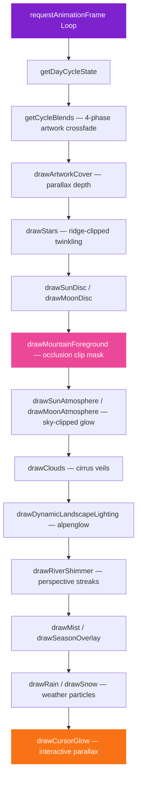

<p align="center">
  
</p>

<p align="center">
  Living landscape · 3D flip cards · Dynamic day cycle · Lunar phases · Seasonal weather
</p>

<p align="center">
  <a href="https://zynztehr.github.io/countdown-timer/">
    
  </a>
  <a href="https://github.com/ZynzTehr">
    
  </a>
  <a href="https://zynztehr.github.io/ZynzTehr-Portfolio/">
    
  </a>
</p>

---

## What Is This

> **A cinematic countdown timer** set against a living, breathing mountain landscape that transitions through dawn, day, dusk, and night in real time — complete with celestial orbits, seasonal weather, and ambient soundscapes.

Not just a timer. An experience.

<table>
<tr>
<td width="50%">

### 3D Flip Cards
Silky CSS perspective-transform cards that flip with every second, minute, hour, day — all the way up to years

### Living Landscape
Hand-painted wallpaper artwork for 4 day phases, cross-faded continuously across a full 24-hour cycle with parallax depth

### Celestial Engine
Sun rises from behind the left pines at dawn, arcs across the summit at noon, and sets behind the mountain saddle at dusk — the moon follows the same trajectory at night

### Accurate Lunar Phases
Real astronomical synodic cycle math — waxing crescent, first quarter, gibbous, full, waning — all rendered with parametric terminator curves

### Mountain Horizon Occlusion
Sun and moon discs physically rise from and set behind the painted mountain ridge silhouette, with atmosphere clipped to the sky region

</td>
<td width="50%">

### Seasonal Weather
Auto-detected spring / summer / autumn / winter with dynamic rain, snow, and atmospheric tinting based on hemisphere latitude

### Live Weather Integration
Optional geolocation-aware weather — real conditions mapped to in-scene rain, snow, and cloud density

### Ambient Soundscapes
Phase-aware audio: birdsong at dawn, crickets at night, rainfall during storms — crossfades seamlessly between states

### Glassmorphism Timer Cards
Frosted glass UI with phase-specific color palettes — warm corals at dawn, golden ambers by day, fiery oranges at dusk, deep violets at night

### River Shimmer & Mist
Specular water reflections with perspective-correct drift, valley mist, twinkling stars, and atmospheric clouds

</td>
</tr>
</table>

---

## Tech Stack

<p align="center">
  
  
  
  
  
  
  
</p>

---

## Architecture

```
countdown-timer/
├── .github/workflows/
│   └── deploy.yml              # CI/CD: npm ci → build → deploy to GitHub Pages
├── public/images/
│   ├── wallpaper-dawn.jpg      # Hand-painted dawn landscape
│   ├── wallpaper-day.jpg       # Hand-painted daytime landscape
│   ├── wallpaper-dusk.jpg      # Hand-painted sunset landscape
│   ├── wallpaper-night.jpg     # Hand-painted night landscape
│   └── header.svg              # Animated README banner
├── src/
│   ├── js/
│   │   ├── main.js             # App entry — timer init, debug hotkeys, presets
│   │   ├── countdown.js        # 3D flip-card countdown logic (years → seconds)
│   │   ├── sceneRenderer.js    # Canvas rendering engine — celestial, weather, lighting
│   │   ├── dayCycle.js         # 24-hour phase state machine & palette interpolation
│   │   ├── lunarPhase.js       # Astronomical synodic lunar phase calculations
│   │   ├── seasonEngine.js     # Hemisphere-aware seasonal detection & weather configs
│   │   ├── liveWeather.js      # Geolocation + OpenWeatherMap integration
│   │   ├── audio.js            # Phase-aware ambient soundscape crossfader
│   │   └── presets.js          # Countdown target date presets
│   └── scss/
│       ├── _variables.scss     # Design tokens: 4 phase palettes, glassmorphism
│       ├── _flip-card.scss     # 3D CSS perspective flip card animations
│       ├── _glass.scss         # Frosted glass panel styling
│       └── _controls.scss      # Date picker & preset selector UI
├── index.html
├── vite.config.js
└── package.json
```

---

## Rendering Pipeline



---

## Day Cycle Phases

| Phase | Hours | Sky | Cards | Celestial |
|---|---|---|---|---|
| 🌅 **Dawn** | 4:30 – 8:00 | Night → coral rose | Warm peach-coral glass | Sun emerging from left pines |
| ☀️ **Day** | 8:00 – 17:00 | Bright cerulean | Golden amber glass | Sun at zenith above summit |
| 🌇 **Dusk** | 17:00 – 21:00 | Amber → deep violet | Fiery orange-crimson glass | Sun setting behind right saddle |
| 🌙 **Night** | 21:00 – 4:30 | Deep indigo | Purple-violet glass | Moon arcing across starfield |

---

## Debug Hotkeys

| Key | Action |
|---|---|
| `1` | Jump to Dawn (6:00) |
| `2` | Jump to Day (12:00) |
| `3` | Jump to Dusk (18:00) |
| `4` | Jump to Night (0:00) |
| `0` | Reset to real time |

Or use URL query: `?hour=18.5` for a specific time.

---

## Getting Started

```bash
# Clone
git clone https://github.com/ZynzTehr/countdown-timer.git
cd countdown-timer

# Install
npm install

# Dev server
npm run dev
```

Visit `http://localhost:5173/countdown-timer/` in your browser.

### Production Build

```bash
npm run build
# Output: dist/
```

---

## Design System

| Token | Value | Usage |
|---|---|---|
| `$color-purple-deep` | `#1e0b36` | Deep background, night cards |
| `$color-purple-light` | `#7e22ce` | Accent glow, night borders |
| `$color-pink-hot` | `#ec4899` | Primary accent, labels, glow |
| `$color-orange-sunset` | `#f97316` | Sunset accent, dusk glow |
| `$color-gold-accent` | `#fbbf24` | Sun disc, highlights |
| `$color-magenta` | `#d946ef` | Night phase, cosmic glow |
| Font: Display | `Outfit` | Headings, labels |
| Font: Digits | `Space Grotesk` | Countdown numbers |

---

## Author

<table>
<tr>
<td>

**Jorge Alberto Bucio** · Full-Stack & Web3 Developer

- [GitHub @ZynzTehr](https://github.com/ZynzTehr)
- [Live Portfolio](https://zynztehr.github.io/ZynzTehr-Portfolio/)
- [VS Code FX Extension](https://marketplace.visualstudio.com/items?itemName=VSCodeFX.vscode-fx)

</td>
</tr>
</table>

---

<p align="center">
  <i>Designed and engineered with 💜 & 🌅 by Jorge Bucio</i>
</p>
